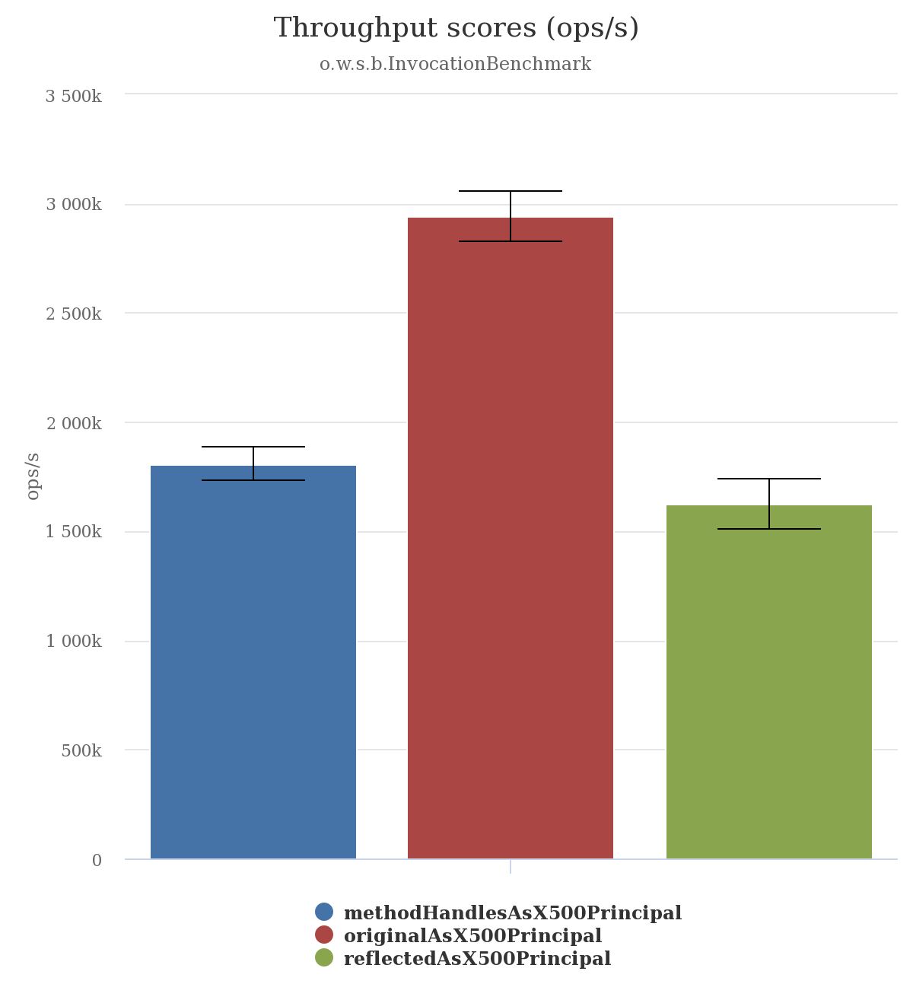

= A JMH benchmark to compare several ways to fix link:https://issues.jboss.org/browse/ELY-437[ELY-437]

The alternatives are as follows:

* Original (baseline) link:https://github.com/ppalaga/wildfly-elytron/blob/817245913b7bc796afaaf9c40dc11207b125fe7e/src/main/java/org/wildfly/security/x500/X500PrincipalUtil.java[X500PrincipalUtil]
* Reflection based link:https://github.com/ppalaga/wildfly-elytron/blob/817245913b7bc796afaaf9c40dc11207b125fe7e/src/main/java/org/wildfly/security/x500/X500PrincipalUtilReflection.java[X500PrincipalUtilReflection]
* MethodHandle based link:https://github.com/ppalaga/wildfly-elytron/blob/817245913b7bc796afaaf9c40dc11207b125fe7e/src/main/java/org/wildfly/security/x500/X500PrincipalUtilMethodHandles.java[X500PrincipalUtilMethodHandles]

== How to run

[source,shell]
----
mvn clean install &&  java -jar ./target/benchmarks.jar
----

== The results

[source,shell]
----
Benchmark                                          Mode  Cnt        Score        Error  Units
InvocationBenchmark.methodHandlesAsX500Principal  thrpt   50  1807555.949 ±  77434.215  ops/s
InvocationBenchmark.originalAsX500Principal       thrpt   50  2943554.017 ± 116646.308  ops/s
InvocationBenchmark.reflectedAsX500Principal      thrpt   50  1622555.432 ± 114268.451  ops/s
----
